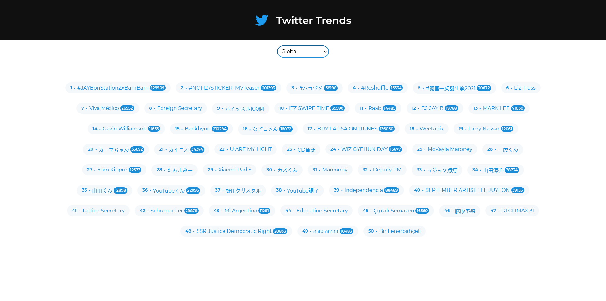

# Twitter Trends React

> React application that display the trends of the moment in Twitter, based on the location.

## 🚀 How to use the project

### 🛹 Clone the repo

`git clone https://github.com/andreseichi/twitter-trends-react.git`

### 📒 Acess the repo

`cd twitter-trends-react`

### 🧭 Install all dependencies with yarn

`yarn install`

### 🌎 Request the api

In the App.jsx, make the request via axios to the backend that provides the api request.
You can clone my backend repo:

### 🔨 Build it

`yarn build`
